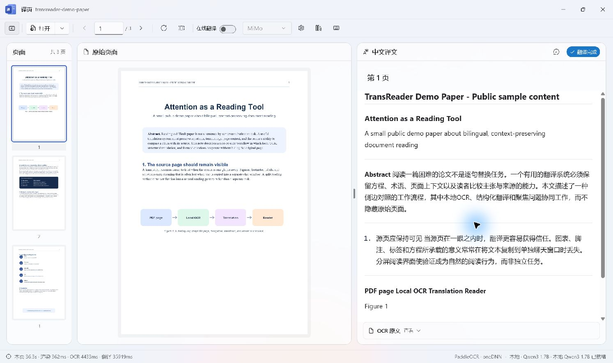
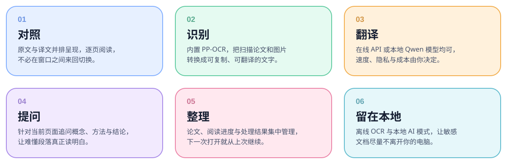
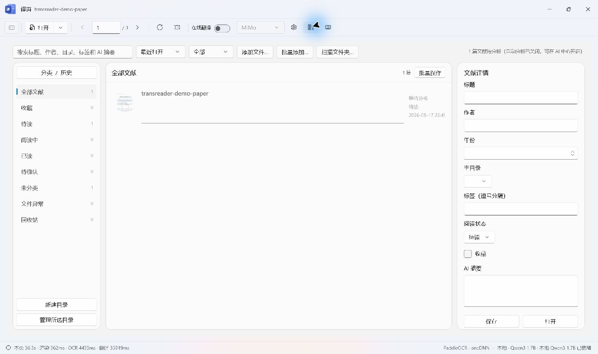
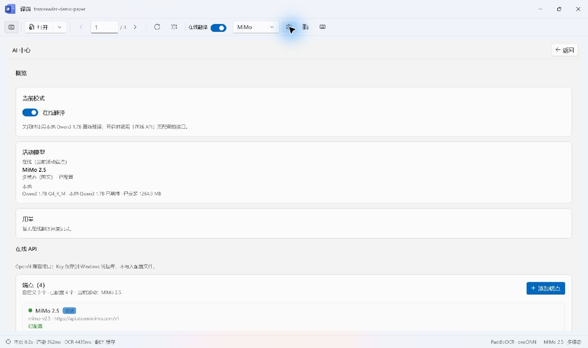

<div align="center">
  
  <h1>译页 TransReader</h1>
  <p><strong>别离开论文，让翻译来到页面旁边。</strong></p>
  <p>一个面向 Windows 的本地优先 PDF 翻译阅读器：适合论文、书籍、说明书、公式和那些值得你停下来真正读懂的段落。</p>
  <p><strong>简体中文</strong> · <a href="README.md">English</a></p>
  <p>
    
    
    
    
  </p>
</div>



## 读一篇难论文，不该像同时操作五个工具

打开 PDF，复制一段话，修复断行和公式，粘贴到翻译网页，再切到聊天窗口提问，然后回到 PDF 里寻找刚才那句话——如果是扫描版，还要再加一个 OCR 工具。几页之后，文档反而被工作流挡住了。

**译页想做的事情很直接：让文档始终留在阅读中心。** 原始页面在左边，干净的 Markdown 译文在右边；扫描页自动经过本地 PP-OCRv5，公式交给 KaTeX；遇到没读懂的句子，选中就问，不必丢掉当前页面和全书上下文。

终于可以少一点来回横跳：打开 PDF，然后真的开始读。

<p align="center"></p>

## 它能帮你做什么

| | |
| --- | --- |
| **📖 原文和译文一直在一起**<br>页面、图表、脚注、标签和公式永远只隔一眼。翻译不再把你带离原文。 | **🔍 扫描 PDF 也能直接读**<br>PP-OCRv5 mobile 检测与识别通过 Paddle Inference 在 CPU 本地运行，不要求 GPU。 |
| **🌐 你决定使用哪个模型**<br>可用 MiMo、Kimi、DeepSeek、GLM，也可添加任意 OpenAI 兼容端点；纯文本和多模态模型都支持。 | **🏠 敏感文档可以完全本地**<br>应用内一键安装 Qwen3 1.7B，llama.cpp 负责本地翻译、文献整理和阅读问答。 |
| **💬 问当前段落，不是面对空白聊天框**<br>选中译文即可解释；助手会结合选区、当前页和附近阅读上下文回答。 | **🗂️ 建一个真正记得进度的文献库**<br>PDF、进度、缩略图、OCR、译文、分类、摘要和术语都放在一起。 |

## 看看真实界面

<table>
  <tr>
    <td width="50%"></td>
    <td width="50%"></td>
  </tr>
  <tr>
    <td><strong>为长期阅读准备的文献库</strong><br>搜索、分类、标签、收藏、进度和缓存都在这里，不必在下载目录里反复打开匿名文件。</td>
    <td><strong>在线与本地 AI 放在一个地方</strong><br>切换模式、管理端点、测试连接、查看用量、选择助手来源，以及安装本地模型。</td>
  </tr>
</table>

以上均为真实 Windows 应用截图，使用的是完全虚构的公开演示论文和隔离配置，没有展示私人文档或 API 凭据。

## 下载与安装

译页目前提供 **Windows x64** 的两种传统发布格式：

| 安装包 | 适合你，如果…… |
| --- | --- |
| `TransReader-vX.Y.Z-win-x64-setup.exe` | 希望像普通 Windows 软件一样安装：开始菜单、可选桌面快捷方式、覆盖升级和标准卸载入口。**推荐大多数用户选择。** |
| `TransReader-vX.Y.Z-win-x64-portable.zip` | 希望自己管理目录、放在其他磁盘，或当前电脑没有软件安装权限。 |

请从仓库的 **Releases** 页面下载。每个版本同时提供 `TransReader-vX.Y.Z-SHA256SUMS.txt`，用于核对安装包完整性。

> 社区构建目前可能没有商业代码签名。如果 Windows SmartScreen 显示“未知发布者”，请先核对 SHA-256，并确认文件确实来自本仓库 Releases；不要使用网盘或二次打包站来源。

详细步骤见[中文安装与使用手册](docs/INSTALL.zh-CN.md)，也可切换到 [English Installation Guide](docs/INSTALL.md)。

### 系统要求

- Windows 10 20H1（19041）或更高版本，x64。
- 支持 AVX 指令集的 x64 CPU。
- 在线模式至少 8 GB 内存；本地 AI 建议 16 GB。
- 应用安装后约需 600 MB；安装可选本地模型与运行时后另需约 1.3 GB。
- Microsoft Edge WebView2 Runtime（Windows 11 通常自带）。

## 三分钟开始阅读

1. 安装 TransReader，或完整解压 Portable ZIP。
2. 打开一个 PDF。原生 PDF 和扫描 PDF 使用同一套阅读界面。
3. 选择翻译方式：
   - **在线模式**：打开“AI 中心”，选择预设或添加 OpenAI 兼容端点，填写模型和 API Key，然后测试连接。
   - **本地模式**：打开“AI 中心 → 本地 AI”，点击安装。模型与运行时下载完成后会检查文件大小和 SHA-256。
4. 左边看原页，右边读译文；遇到值得深挖的句子，选中并提问。
5. 长期阅读的资料可以导入文献库，让进度、OCR、译文和整理结果保留下来。

## 在线还是本地？每份文档都可以自己决定

| | 在线 API | 本地 AI |
| --- | --- | --- |
| 更适合 | 强大的多模态模型、速度、复杂页面理解 | 敏感文档、离线环境、希望内容留在本机 |
| 发送内容 | 当前页图像或 OCR 文本、必要上下文和你的问题 | 不向外部模型 API 发送页面内容 |
| API Key | 保存于 Windows 凭据库 | 不需要 |
| 硬件 | 普通 CPU 和内存即可 | CPU 推理，建议 16 GB 内存 |
| 费用 | 由你选择的服务商决定 | 没有按 Token 计费的 API 成本 |

OCR 始终在本地运行。在线模式只把内容交给你明确选择的端点。阅读保密材料时，还应把“文献库整理”和“阅读助手”的模型来源一并设为本地。

## 它不只是逐句替换词语

- Markdown 与 KaTeX 保留标题、列表、代码、行内公式和独立公式。
- 页面 OCR 缓存避免重复执行高成本识别。
- 译文缓存让快速翻页和下次续读更顺畅。
- 运行摘要与术语上下文让专有名词在跨页翻译时更稳定。
- 数学、计算机、物理等领域配置会调整提示词，且允许用户覆盖领域说明。
- 快速翻页时会取消过期任务，让后台工作跟随读者，而不是让读者等待旧页面。

## 隐私与本地数据

- API Key 通过 Windows 凭据库保存，不进入仓库，也不写入 `settings.json`。
- 设置、文献库、日志、本地模型和缓存位于 `%LOCALAPPDATA%\TransReader`。
- 本地模式的页面推理不离开设备。
- 在线模式会把内容发送到用户配置的服务商，其隐私政策、条款和费用规则仍然适用。
- 把日志贴到公开 issue 前，请先删除个人路径、文档内容和其他敏感信息。

安全问题报告方式见 [SECURITY.md](SECURITY.md)。

## 从源码构建

全新克隆后可以一键准备固定版本的原生依赖：

```powershell
.\scripts\setup-build-dependencies.ps1
.\scripts\build.ps1 -Configuration Release
dotnet test .\tests\TransReader.Core.Tests -c Release
```

安装 Inno Setup 后，可同时生成 Setup 与 Portable：

```powershell
.\scripts\publish.ps1 -Version 0.3.0
```

完整说明见[中文构建手册](docs/BUILDING.zh-CN.md)或 [Building TransReader from Source](docs/BUILDING.md)。

## 项目结构

```text
src/TransReader.App          WinUI 3 界面与应用编排
src/TransReader.Core         OCR、翻译、存储、文献库与文档逻辑
native/TransOcrNative        稳定 C ABI 与 PaddleOCR 原生宿主
third_party/PaddleOCR        选取的 PaddleOCR C++ 推理源码快照
tests/TransReader.Core.Tests 核心单元测试
scripts                      依赖、构建与发布自动化
installer                    Inno Setup 安装器定义
```

## 当前边界

译页目前只支持 Windows x64，应用界面以简体中文为主；中英文使用、安装和构建文档已经齐备，应用 UI 国际化是后续很欢迎的贡献方向。项目正在走向第一次正式公开发布，因此安装反馈和真实阅读场景中的问题尤其有价值。

## 参与贡献

欢迎一起把它做得更好。请从 [CONTRIBUTING.md](CONTRIBUTING.md) 开始，不要在 issue 中上传私人 PDF 或凭据，界面改动请附截图。

如果译页能在一篇难论文里帮你省下哪怕十分钟的来回切换，它就已经完成了最初想做的事情。喜欢的话，欢迎点一颗 ⭐。

## 开源协议

TransReader 源代码以 [MIT License](LICENSE) 发布。第三方库、运行时和模型仍使用各自许可证，详见 [THIRD_PARTY_NOTICES.md](THIRD_PARTY_NOTICES.md)。
